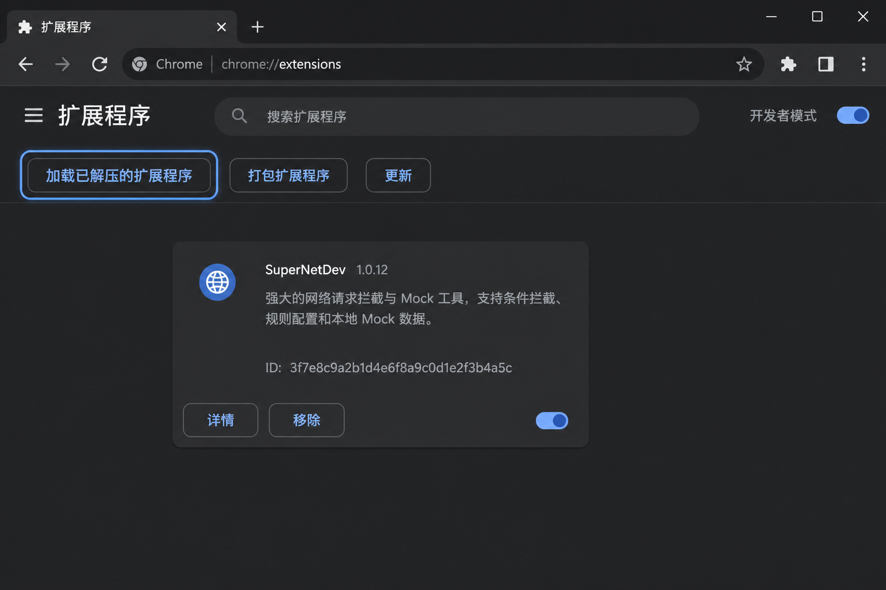
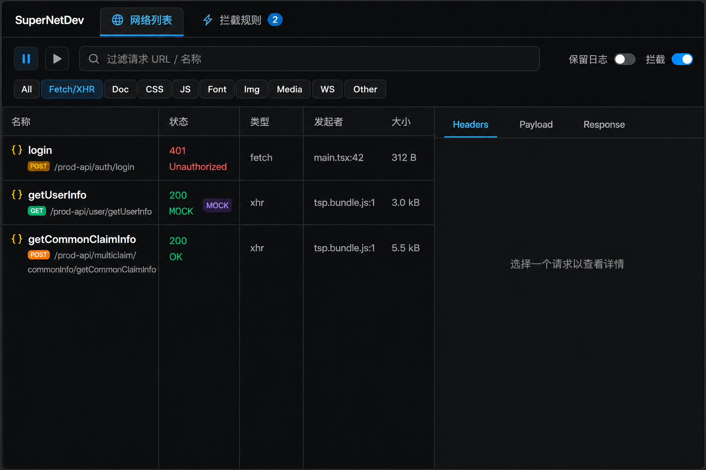
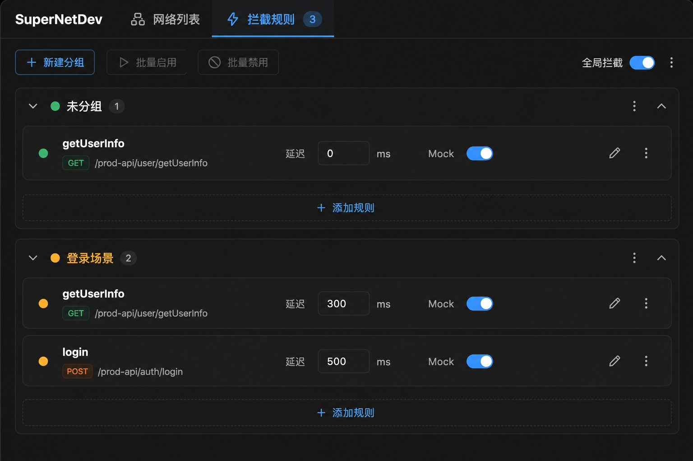

  

<h1 align="center">SuperNetDev</h1>

  <strong>Chrome DevTools 面板：看请求 · 改接口 · Mock 响应</strong>

  模糊匹配拦截 · 延迟 · 改头改体 · 双栏 Diff · 规则场景组

  <a href="./README.md">English</a> ·
  <a href="./README.zh-CN.md"><strong>简体中文</strong></a>

  
  
  

  <a href="#能做什么">功能</a> ·
  <a href="#安装">安装</a> ·
  <a href="#快速上手">上手</a> ·
  <a href="#匹配规则">匹配</a> ·
  <a href="#常见问题">FAQ</a> ·
  <a href="#更新">更新</a>

---

> [!TIP]
> 本目录就是可加载的扩展包。按下方步骤加载到 Chrome 即可使用，无需额外安装环境。

> [!NOTE]
> 拦截主要作用于页面里的 **Fetch / XHR** 接口。静态资源仍可在列表中查看，但默认不会被改写。

---

## 能做什么

| 能力 | 说明 |
| :--- | :--- |
| **网络列表** | 类似 Chrome Network：名称、状态、类型、发起者、大小、耗时 |
| **过滤** | All、Fetch/XHR、Doc、CSS、JS、Font、Img、Media、WS、Other |
| **模糊匹配** | 包含 / 通配符 / 正则 / 精确；命中后名称旁出现编辑图标 |
| **延迟** | 按毫秒延迟，方便测 loading、超时 |
| **改头改体** | 增删改请求头、响应头；替换请求体 |
| **Mock 响应** | 整段 Mock，可不发真实请求 |
| **双栏 Diff** | 有改写时左右对比原始 / 当前响应 |
| **字段备注** | JSON 字段旁可加备注，按接口记住 |
| **规则场景组** | 分组、颜色、折叠；一键启停 / 切换场景 |
| **版本提醒** | 有新版本时「关于工具」出现小红点，可去下载 |

---

## 安装

  

1. 确认本文件夹完整（包含 `manifest.json`、`icons` 等）
2. 打开 Chrome，地址栏进入：`chrome://extensions`
3. 右上角打开 **开发者模式**
4. 点击 **加载已解压的扩展程序**
5. 选择**本文件夹**（解压后的整个目录）
6. 打开任意网页 → 按 **F12** → 顶部面板找到并点开 **SuperNetDev**

> [!IMPORTANT]
> 加载的是「已解压的文件夹」，不要只选里面的某个子文件。若你是从 ZIP 下载的，请先完整解压。

---

## 快速上手

  

1. 打开要调试的页面 → **F12** → **SuperNetDev**
2. 顶部切到 **网络列表**，过滤选 **Fetch/XHR**
3. 刷新页面，点击一条接口查看详情（Headers / Payload / Response）
4. 点 **从此请求创建规则**（或顶部 **新建规则**）
5. 配置延迟、Mock 响应、改头改体等，保存（支持 `Ctrl+S`）
6. 确认顶部 **拦截** 开关已打开，再刷新页面验证

  

在 **拦截规则** 页可以：

- 按场景分组管理规则  
- 一键启用 / 停用整组  
- 给分组上色、折叠  

> [!IMPORTANT]
> 关闭开发者工具后，**已启用的拦截规则仍然生效**。不需要拦截时，请关掉「拦截」开关，或停用对应规则。

---

## 匹配规则

| 方式 | 例子 | 说明 |
| :--- | :--- | :--- |
| 模糊 | `getStudentInfo` | 可命中 `/cs-api/student/getStudentInfo?studentId=20240001` |
| 通配符 | `*/cs-api/course/*` | `*` 匹配任意片段 |
| 正则 | `claimInfo$` | 按正则匹配 URL |
| 精确 | 完整 URL 或路径 | 完全一致才命中 |

命中已启用规则的请求，名称旁会显示铅笔图标，点击即可编辑该规则。

---

## 常用操作

| 操作 | 怎么做 |
| :--- | :--- |
| 切换网络列表 / 拦截规则 | 顶部两个大标签；也可右键按住左右滑动切换 |
| 搜索请求 | `Ctrl+F`（鼠标在 JSON 区域时，会先搜当前文本） |
| 保存规则 | 规则编辑页 `Ctrl+S` |
| 清空列表 | 工具栏橡皮擦按钮 |
| 保留刷新前日志 | 打开「保留日志」 |
| 检查更新 | 点「关于工具」；有红点说明有新版本 |

---

## 更新

1. 打开面板，若 **关于工具** 有小红点，点进去  
2. 在版本旁点 **去下载**，获取最新压缩包  
3. 解压后覆盖本目录（或重新「加载已解压的扩展程序」指向新目录）  
4. 回到 `chrome://extensions`，点扩展卡片上的 **重新加载**

最新版本始终可在：[Releases](https://github.com/izhuyan/SuperNetDev/releases)

---

## 常见问题

**Q：面板里没有请求？**  
确认过滤是否为 Fetch/XHR，刷新页面；确认正在调试的是当前打开的网页标签。

**Q：规则保存了但不生效？**  
检查顶部 **拦截** 是否开启、规则是否 **启用**、匹配模式是否能命中当前 URL；改规则后建议刷新页面。

**Q：关掉 F12 后接口还在被改？**  
这是预期行为。关闭「拦截」开关，或禁用相关规则即可恢复。

**Q：如何卸载？**  
`chrome://extensions` → SuperNetDev → **移除**。

---

## 赞助

如果 SuperNetDev 帮你省了联调时间，欢迎在面板里点 **赞助作者**。

微信：`bbq-nu`

---

  Made for frontend debugging · SuperNetDev

